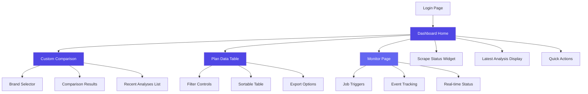
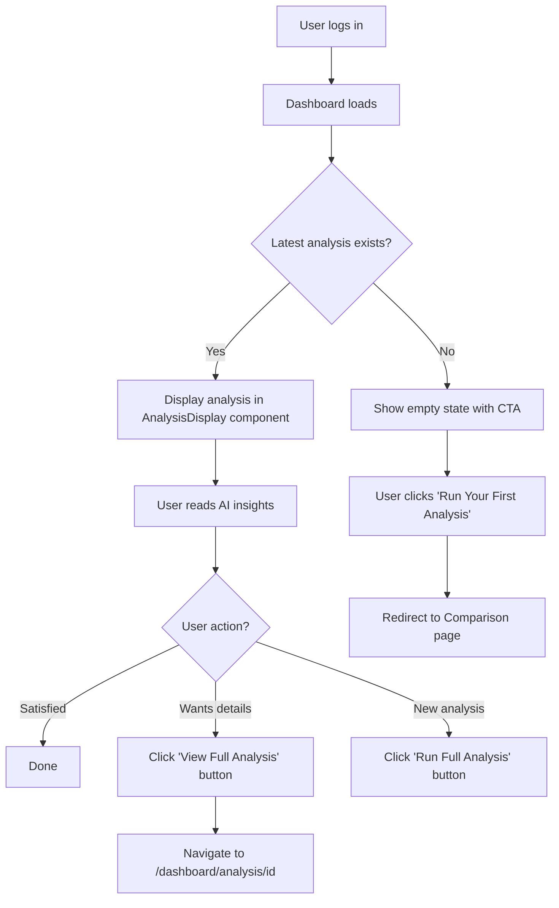
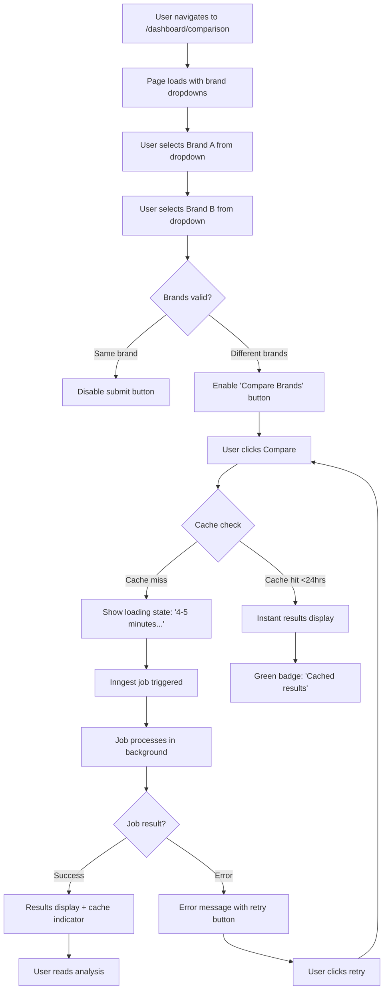
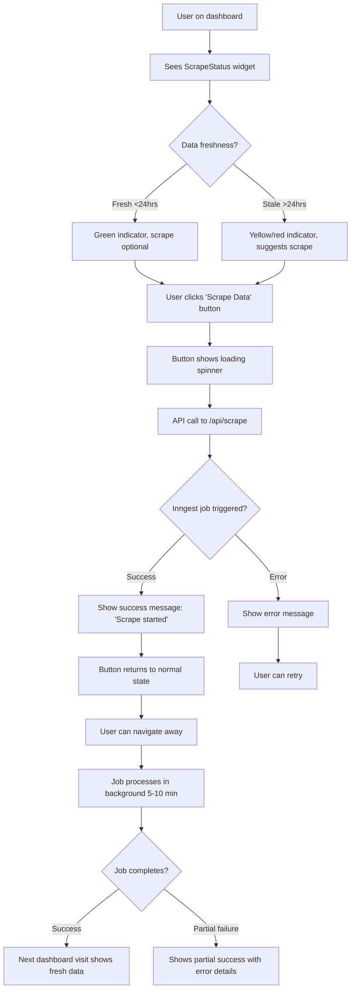
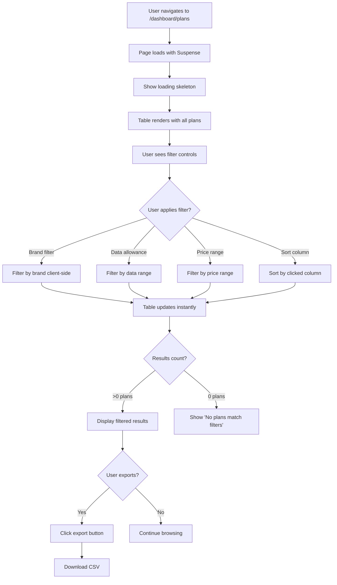

# Scrape and Compare UI/UX Specification

This document defines the user experience goals, information architecture, user flows, and visual design specifications for Scrape and Compare's user interface. It serves as the foundation for visual design and frontend development, ensuring a cohesive and user-centered experience.

---

## Overall UX Goals & Principles

### Target User Personas

1. **Pricing Analyst** - Business professionals who analyze competitive pricing daily. Need fast access to comparative data, clear insights, and ability to share findings with stakeholders.

2. **Product Manager** - Decision-makers who need high-level competitive insights to inform product strategy. Value AI-generated recommendations and trend analysis over raw data.

3. **Data Analyst** - Technical users who want to explore plan details, filter data extensively, and export for further analysis. Comfortable with tables and raw numbers.

### Usability Goals

- **Speed to Insight:** Users can view latest competitive analysis within 3 seconds of login
- **Comparison Efficiency:** Custom brand comparisons can be triggered in 3 clicks maximum
- **Data Exploration:** Plan filtering and sorting provides results in <500ms (feel instant)
- **AI Transparency:** Analysis results clearly distinguish cached vs fresh data
- **Self-Service:** No training required - interface is intuitive for first-time users

### Design Principles

1. **Data First, Chrome Second** - Maximize space for insights, minimize UI decoration
2. **Progressive Disclosure** - Show executive summary first, details on demand
3. **Status Awareness** - Always show data freshness and system state prominently
4. **Instant Feedback** - Every interaction has immediate visual response
5. **Smart Defaults** - Sensible pre-selections reduce cognitive load

---

## Information Architecture

### Site Map / Screen Inventory



### Navigation Structure

**Primary Navigation:**
- Horizontal header navigation bar (sticky on scroll)
- Three main sections: Dashboard, Compare, Plans
- Monitor page accessible but secondary (admin/debug tool)
- Logo on left, user menu (logout) on right

**Secondary Navigation:**
- Quick action cards on dashboard home linking to Compare and Plans
- Breadcrumbs showing current location (Dashboard > Comparison)
- Back-to-dashboard link on all internal pages

**Navigation Hierarchy:**
```
Header (Global)
├── Logo → Dashboard Home
├── Dashboard (active by default)
├── Compare → Custom Comparison Page
├── Plans → Plan Data Table
├── [Data Freshness Indicator]
└── User Menu → Logout

Dashboard Home Cards (Secondary)
├── "Compare Brands" → /dashboard/comparison
└── "Browse Plans" → /dashboard/plans
```

**Breadcrumb Strategy:**
- Always show breadcrumbs on non-home pages
- Format: Dashboard > [Current Page Name]
- Clickable navigation trail
- Hidden on mobile to save vertical space

---

## User Flows

### Flow 1: View Latest Competitive Analysis

**User Goal:** Quickly check the most recent AI-generated competitive insights without triggering new analysis

**Entry Points:**
- Direct login → Dashboard (primary)
- Header navigation → Dashboard link

**Success Criteria:** User views latest analysis results within 3 seconds of login

**Flow Diagram:**



**Edge Cases & Error Handling:**
- Database query fails → Show error message with retry button
- Analysis data malformed → Log error, show "Unable to display analysis"
- No analyses in system yet → Show onboarding empty state with clear CTA
- Stale data (>7 days old) → Display warning banner suggesting fresh scrape

**Notes:** This is the #1 most common flow. Performance critical - must feel instant.

---

### Flow 2: Run Custom Brand Comparison

**User Goal:** Compare two specific telco brands (e.g., O2 vs Vodafone) and get AI-powered insights

**Entry Points:**
- Dashboard → "Compare Brands" quick action card
- Header navigation → Compare link
- Dashboard → Recent Analyses → "View analysis" (loads cached result)

**Success Criteria:** User successfully triggers comparison and receives either instant cached result OR understands wait time for fresh analysis

**Flow Diagram:**



**Edge Cases & Error Handling:**
- No plans for selected brand → Clear error: "No plan data available for [Brand]. Run scrape first."
- Gemini API rate limit → Queue job, show estimated wait time
- Gemini API error → Retry 3x with exponential backoff, then show error
- Network failure → Show offline message with auto-retry countdown
- Browser closed during analysis → Job continues server-side, results available on return
- Cache expiry during view → No action needed (cached results still valid for viewing)

**Notes:** Cache intelligence is key UX win here - 24hr TTL prevents redundant 5-minute waits.

---

### Flow 3: Trigger Data Scrape

**User Goal:** Collect fresh plan data from all telco sources to ensure analysis is based on current market

**Entry Points:**
- Dashboard → "Scrape Data" button (primary)

**Success Criteria:** User successfully triggers scrape job and understands it's processing in background

**Flow Diagram:**



**Edge Cases & Error Handling:**
- Scrape already running → Disable button, show "Scrape in progress..."
- Browserless API down → Error with specific source failures listed
- Database write failure → Log error, notify admin, show user-friendly error
- Rate limiting from telco sites → Graceful backoff, complete as many as possible
- User navigates away mid-scrape → Job continues, no impact
- Gemini API unavailable → Scrape completes, analysis waits for API

**Notes:** Non-blocking UX is critical - users shouldn't wait 10 minutes. Background jobs = better experience.

---

### Flow 4: Browse and Filter Plan Data

**User Goal:** Explore raw plan data with filtering to find specific offerings or patterns

**Entry Points:**
- Dashboard → "Browse Plans" quick action card
- Header navigation → Plans link

**Success Criteria:** User can filter 356+ plans down to relevant subset in <1 second

**Flow Diagram:**



**Edge Cases & Error Handling:**
- No plans in database → Show empty state: "No plan data. Run scrape to collect."
- Database query timeout → Show error with retry
- Invalid filter combination → Show "No results" with suggestion to adjust
- Export fails → Toast error notification
- Mobile view → Horizontal scroll table or card view (responsive adaptation)

**Notes:** Client-side filtering for snappy UX since dataset is <500 rows. Re-evaluate if grows to 10k+.

---

## Wireframes & Mockups

### Primary Design Files

**Design Tool:** Figma (recommended) or equivalent
**File Location:** [To be created - link will be added here]

**Design System Base:** shadcn/ui components with Tailwind CSS
- Pre-built accessible components
- Consistent with Next.js/React ecosystem
- Customizable design tokens

---

### Key Screen Layouts

#### Screen 1: Dashboard Home

**Purpose:** Primary landing page showing system status, latest analysis summary, and quick actions

**Layout Structure (Desktop):**
```
┌────────────────────────────────────────────────────────┐
│  Header: Logo | Dashboard | Compare | Plans | [User]  │
├────────────────────────────────────────────────────────┤
│  Data Freshness: 🟢 Last scraped 2 hours ago          │
├──────────────────┬─────────────────────────────────────┤
│                  │                                     │
│  Scrape Status   │   Latest Analysis Summary           │
│  Card            │   ─────────────────────────         │
│  ─────────────   │   O2 vs All Competitors             │
│  356 plans       │   Generated 3 hours ago             │
│  Last: 2hr ago   │                                     │
│  [Scrape Data]   │   Top 3 Insights (preview):         │
│                  │   • Pricing gap: -£3.50/mo          │
│                  │   • Data parity achieved            │
│                  │   • Feature opportunity: 5G         │
│                  │                                     │
│                  │   [View Full Analysis →]            │
│                  │                                     │
├──────────────────┴─────────────────────────────────────┤
│  Quick Actions                                         │
│  ┌─────────────────┐  ┌──────────────────┐            │
│  │ Compare Brands  │  │  Browse Plans    │            │
│  │ →               │  │  →               │            │
│  └─────────────────┘  └──────────────────┘            │
└────────────────────────────────────────────────────────┘
```

**Component Breakdown:**
- **Header** (sticky): DashboardHeader component
- **Data Freshness Banner**: Contextual color (green/yellow/red) based on age
- **Scrape Status Card**: White card, shadow-sm, displays plan count, last scrape timestamp, CTA button
- **Analysis Summary Card**: Larger card with title, timestamp, top 3 insights preview, "View Full Analysis" button
- **Quick Action Cards**: Grid layout (2 columns on desktop, 1 on tablet), large clickable cards with icons

**States:**
- **Empty State (No Analysis):** Shows "Run Your First Analysis" CTA linking to comparison page

---

#### Screen 2: Custom Comparison Page

**Purpose:** Allow users to select two brands, view/trigger comparative analysis, and easily navigate past comparisons

**Layout Structure (Split Panel - 30/70):**

```
┌────────────────────────────────────────────────────────┐
│  Header (same as home)                                 │
├────────────────────────────────────────────────────────┤
│  Breadcrumb: Dashboard > Brand Comparison              │
├──────────────────────┬─────────────────────────────────┤
│                      │                                 │
│  Comparison Tool     │  Results Panel                  │
│  ─────────────────   │  ────────────────               │
│                      │                                 │
│  Select Brands       │  [Results appear here]          │
│  ┌────────────┐      │                                 │
│  │Brand A ▼   │      │  • Empty state initially        │
│  │ [O2     ]  │      │  • Analysis results after       │
│  └────────────┘      │    comparison                   │
│        ↕             │  • Cached indicator if          │
│  ┌────────────┐      │    applicable                   │
│  │Brand B ▼   │      │                                 │
│  │[Vodafone]  │      │  Competitive Insights           │
│  └────────────┘      │  (cards)                        │
│                      │                                 │
│  [Compare Brands]    │  Analysis Details               │
│                      │  (expandable)                   │
│  ──────────────      │                                 │
│  Recent Analyses     │                                 │
│  (compact list)      │                                 │
│                      │                                 │
│  • O2 vs Vodafone    │                                 │
│    2h ago [View]     │                                 │
│  • Sky vs Three      │                                 │
│    1d ago [View]     │                                 │
│  • More... (5) ▼     │                                 │
│                      │                                 │
└──────────────────────┴─────────────────────────────────┘
```

**Key Improvements:**
- **Side-by-Side Layout:** Results don't push past comparisons down
- **Sticky Left Panel:** Tools always accessible even when scrolling results
- **Collapsed Recent List:** Shows only 3 most recent, "Show more" to expand
- **Independent Scrolling:** Right panel scrolls if analysis is long, left panel stays fixed

**Mobile Adaptation (<768px):**
- Tab Navigation instead of split panel
- Tab 1: "Comparison" - Selectors + Results
- Tab 2: "History" - Recent analyses list (full width, easier to browse)

---

#### Screen 3: Plan Data Table

**Purpose:** Comprehensive view of all scraped plan data with filtering and sorting

**Layout Structure:**
```
┌────────────────────────────────────────────────────────┐
│  Header (same as home)                                 │
├────────────────────────────────────────────────────────┤
│  Breadcrumb: Dashboard > Plan Data                     │
├────────────────────────────────────────────────────────┤
│  Filter Controls                                       │
│  ┌─────────┐ ┌──────────┐ ┌──────────┐ [Export CSV]   │
│  │Brand ▼  │ │Data ▼    │ │Price ▼   │                │
│  └─────────┘ └──────────┘ └──────────┘                │
│                                                        │
│  Showing 356 plans                                     │
├────────────────────────────────────────────────────────┤
│  Plan Data Table (scrollable)                          │
│  ┌────┬────────┬───────┬───────┬──────────┬─────────┐ │
│  │Brnd│ Data   │ Price │Length │ Features │ Source  │ │
│  ├────┼────────┼───────┼───────┼──────────┼─────────┤ │
│  │ O2 │ 20GB ↓ │£15.00 │12 mo  │5G, EU    │Direct   │ │
│  │Sky │ 25GB   │£12.00 │ 1 mo  │Unlim txt │Direct   │ │
│  │... │        │       │       │          │         │ │
│  └────┴────────┴───────┴───────┴──────────┴─────────┘ │
└────────────────────────────────────────────────────────┘
```

**Component Breakdown:**
- **Filter Bar:** Multi-select dropdowns, "Clear filters" button, Export button
- **Data Table:** Sticky header on scroll, sortable columns, alternating row colors
- **Tablet Adaptation:** Some columns hidden on smaller screens

---

#### Screen 4: Login Page

**Purpose:** Password authentication gate before dashboard access

**Layout Structure:**
```
┌────────────────────────────────────────────────────────┐
│                                                        │
│                    [Logo/Brand]                        │
│                                                        │
│            Scrape and Compare                          │
│            ─────────────────                           │
│                                                        │
│       ┌──────────────────────────────┐                 │
│       │  Enter Password              │                 │
│       │  ┌────────────────────────┐  │                 │
│       │  │ ••••••••••             │  │                 │
│       │  └────────────────────────┘  │                 │
│       │                              │                 │
│       │     [Login]                  │                 │
│       │                              │                 │
│       │  [Error message area]        │                 │
│       └──────────────────────────────┘                 │
│                                                        │
└────────────────────────────────────────────────────────┘
```

**Component Breakdown:**
- Center card (max-width 400px)
- Password input (type="password")
- Login button (full width)
- Error alert appears on failure

---

#### Screen 5: Dedicated Analysis Page

**Purpose:** Full-detail view of a specific analysis with all insights, shareable URL

**Route:** `/dashboard/analysis/[id]`

**Layout Structure:**
```
┌────────────────────────────────────────────────────────┐
│  Header (same as all pages)                            │
├────────────────────────────────────────────────────────┤
│  Breadcrumb: Dashboard > Analysis > Nov 20, 2025       │
├────────────────────────────────────────────────────────┤
│  O2 vs All Competitors                                 │
│  Full Competitive Analysis                             │
│                                                        │
│  Generated: Nov 20, 2025 at 2:35 PM                    │
│  [✓ Cached Result]                                     │
│                                                        │
├────────────────────────────────────────────────────────┤
│  Executive Summary                                     │
│  • Competitive Score: 7.2/10                           │
│  • Price Position: 3rd of 8                            │
│                                                        │
├────────────────────────────────────────────────────────┤
│  Detailed Insights (All Sections Fully Expanded)       │
│                                                        │
│  ▼ Pricing Opportunities (3 insights)                  │
│  ▼ Product Gaps (2 insights)                           │
│  ▼ Market Positioning (4 insights)                     │
│  ▼ Strategic Recommendations (5 items)                 │
│                                                        │
├────────────────────────────────────────────────────────┤
│  [← Back to Dashboard]  [Run New Comparison]           │
└────────────────────────────────────────────────────────┘
```

**Benefits:**
- Shareable URL for stakeholders
- Bookmarkable for important analyses
- Print-friendly layout
- Focused view without distractions

---

## Component Library / Design System

### Design System Approach

**Foundation:** **shadcn/ui + Tailwind CSS**

**Installation:**
```bash
npx shadcn-ui@latest init
```

**Core Philosophy:**
- Composition over configuration
- Accessibility by default (WCAG 2.1 AA compliance - deferred to post-MVP)
- Consistent patterns across all components
- Performance optimized (tree-shakeable)

---

### Core Components

#### 1. Button
- **Variants:** primary, secondary, ghost, destructive, link
- **States:** default, hover, active, disabled, loading
- **Sizes:** sm (36px), default (40px), lg (44px)

#### 2. Card
- **Variants:** default, interactive, outlined, flat
- **States:** default, hover, loading, error

#### 3. Dropdown Select
- **Variants:** default, searchable, multi
- **States:** default, open, focused, disabled, error

#### 4. Badge
- **Variants:** success, warning, danger, neutral, primary
- **States:** default, outline, dot

#### 5. Data Table
- **Variants:** default, striped, compact
- **States:** sortable, loading, empty, error

#### 6. Accordion
- **Variants:** default, multiple, collapsible
- **States:** closed, open, disabled

#### 7. Alert / Toast
- **Variants:** success, error, warning, info
- **States:** static, toast, dismissible

#### 8. Skeleton
- **Variants:** text, card, table, circle
- **Animation:** Pulse effect

---

## Branding & Style Guide

### Color Palette

| Color Type | Hex Code | Usage |
|------------|----------|-------|
| **Primary** | `#4F46E5` | Primary buttons, links, active states |
| **Primary Hover** | `#4338CA` | Button hover states |
| **Success** | `#10B981` | Positive feedback, fresh data |
| **Warning** | `#F59E0B` | Cautions, stale data warnings |
| **Error** | `#EF4444` | Errors, destructive actions |
| **Neutral 50** | `#F9FAFB` | Page background |
| **Neutral 100** | `#F3F4F6` | Card backgrounds |
| **Neutral 200** | `#E5E7EB` | Borders, dividers |
| **Neutral 600** | `#4B5563` | Secondary text |
| **Neutral 700** | `#374151` | Primary text, headings |
| **Neutral 900** | `#111827` | Strong emphasis |

### Typography

**Font Family:** Inter (Google Fonts)

| Element | Size | Weight | Line Height |
|---------|------|--------|-------------|
| **H1** | 36px | 700 Bold | 1.2 |
| **H2** | 30px | 600 Semibold | 1.3 |
| **H3** | 24px | 600 Semibold | 1.4 |
| **Body** | 14px | 400 Regular | 1.5 |
| **Small** | 12px | 500 Medium | 1.4 |

### Iconography

**Icon Library:** Lucide React

**Common Icons:**
- Navigation: ArrowRight, ArrowLeft, ChevronDown, X
- Actions: RefreshCw, Download, Search
- Status: CheckCircle2, AlertCircle, XCircle, Loader2
- Data: TrendingUp, TrendingDown, BarChart, Table

**Icon Sizing:**
- Small: 16px (w-4 h-4)
- Default: 20px (w-5 h-5)
- Large: 24px (w-6 h-6)

### Spacing & Layout

**Grid System:** 12-column CSS Grid

**Container:**
- Max width: 1280px (max-w-7xl)
- Padding: 16px mobile, 24px tablet, 32px desktop

**Spacing Scale (4px base):**
- space-4: 16px (card padding)
- space-6: 24px (section spacing)
- space-8: 32px (page sections)

---

## Responsiveness Strategy

### Supported Devices

**Target Platforms:** Desktop and Tablet only (MVP scope)

**Breakpoints:**

| Breakpoint | Min Width | Target Devices |
|------------|-----------|----------------|
| **Tablet** | 768px | iPad, Surface, Android tablets |
| **Desktop** | 1024px | Laptops, desktop monitors (Primary) |
| **Wide** | 1920px | Large monitors, 4K displays |

**Mobile (<768px):** Not supported - show message directing to desktop

### Adaptation Patterns

**Desktop (1024px+):**
- Two-column layouts
- Full-width navigation
- Side-by-side cards

**Tablet (768px - 1023px):**
- Single column for split panels
- Stacked cards
- Persistent horizontal navigation (no hamburger)

**Mobile Fallback:**
```tsx
{isMobile && (
  <div className="min-h-screen flex items-center justify-center">
    <Card className="max-w-md text-center">
      <CardHeader>
        <Monitor className="w-12 h-12 mx-auto mb-4" />
        <CardTitle>Desktop Required</CardTitle>
      </CardHeader>
      <CardContent>
        <p>Please access from a device with screen width ≥768px</p>
      </CardContent>
    </Card>
  </div>
)}
```

---

## Performance Considerations (MVP)

### Performance Goals

- **Initial Page Load:** < 3 seconds
- **Route Navigation:** < 1 second
- **Table Filtering:** Feel responsive

### Design Strategies

**Keep It Simple:**
- Use Next.js default optimizations
- Let Tailwind CSS purge unused styles
- Use server components where implemented
- Client-side filtering acceptable for ~350 rows

**Basic Optimizations:**
- Parallel data fetching (already implemented)
- 24-hour cache for analysis results (already implemented)
- `force-dynamic` + `revalidate = 0` for fresh data (already configured)

**Avoid Premature Optimization:**
- No virtual scrolling needed yet
- No complex state management needed
- Performance monitoring post-MVP

---

## Next Steps

### Immediate Actions

1. **Review and approve** this specification with stakeholders
2. **Create visual designs** in Figma based on wireframes and style guide
3. **Begin implementation** using shadcn/ui + Tailwind CSS
4. **Iterate** based on feedback during development

### Design Handoff Checklist

- [x] All user flows documented
- [x] Component inventory complete
- [x] Responsive strategy clear (Desktop/Tablet only)
- [x] Brand guidelines incorporated
- [x] Performance approach defined

---

**Document Version:** 1.0
**Last Updated:** November 20, 2025
**Author:** Sally (UX Expert)
**Status:** Ready for Implementation
